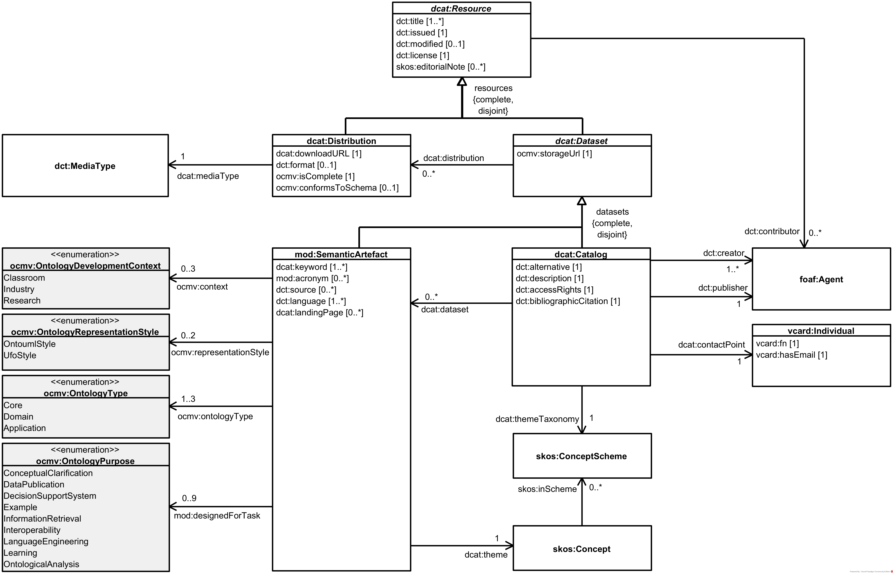

# OntoUML/UFO Catalog

The **OntoUML/UFO Catalog** is a curated collection of conceptual models for research and reuse. These models describe concepts and relationships in domains such as trust, services, or software; they are not collections of observations about individual objects. [OntoUML](https://ontouml.org/ontouml/) is a conceptual modeling language based on the **Unified Foundational Ontology (UFO)**, a foundation for describing categories and relationships in models.

Also known as the FAIR Model Catalog for Ontology-Driven Conceptual Modeling Research, the catalog supports empirical research into *why*, *where*, and *how* modeling approaches are used. It brings together models from different domains, purposes, and levels of modeling experience as structured, machine-processable material. Curation and automated checks do not guarantee every model's semantic quality or suitability for a particular use.

| I want to… | Start here |
| --- | --- |
| View or download a model | [Using models](documentation/using-models.md) — choose PNG, VPP, JSON, Turtle, or a complete source snapshot |
| Reuse or cite the collection | [Citation guidance](documentation/using-models.md#cite-the-catalog-and-the-models-you-use) and [existing license statements](#license-disclaimer) |
| Submit a model or report a problem | [Contribution and support guide](documentation/contributing.md) |
| Understand the formats and validation limits | [Technical overview](documentation/technical-overview.md) |
| Run repository maintenance tools | [Script index and setup](scripts/README.md) |

This GitHub repository is the **storage, distribution, and contribution layer**. The [FAIR Data Point (FDP)](https://w3id.org/ontouml-models) is a separately operated **discovery layer**. This documentation covers the repository, not FDP operations. See the [documentation index](documentation/README.md) for the full reader paths.

The existing [catalog dashboard](http://w3id.org/ontouml-models/dashboard) is another overview entry point; its operational behavior is outside this repository documentation's inspected scope.

## Table of Contents

- [OntoUML/UFO Catalog](#ontoumlufo-catalog)
  - [Table of Contents](#table-of-contents)
  - [Catalog’s Content](#catalogs-content)
    - [Data Organization](#data-organization)
    - [Catalog Releases](#catalog-releases)
    - [Data Schemas](#data-schemas)
      - [OntoUML Metamodel](#ontouml-metamodel)
      - [OntoUML Schema](#ontouml-schema)
      - [Models in Linked Data](#models-in-linked-data)
    - [Metadata](#metadata)
    - [FAIR Data Point: The Data Discovery Service](#fair-data-point-the-data-discovery-service)
  - [Catalog's Persistent URLs](#catalogs-persistent-urls)
  - [How to Contribute](#how-to-contribute)
    - [Contribute by Submitting an Ontology](#contribute-by-submitting-an-ontology)
    - [Other Ways to Contribute](#other-ways-to-contribute)
  - [Relevant Associated Works](#relevant-associated-works)
  - [Catalog administration](#catalog-administration)
  - [How to Cite this Catalog](#how-to-cite-this-catalog)
  - [Acknowledgements](#acknowledgements)
  - [License disclaimer](#license-disclaimer)

## Catalog’s Content

### Data Organization

Each direct folder under [models/](models/) contains a model and its available representations. Folder names commonly combine an author, year, or model name; read `metadata.yaml` for the actual description and sources.

| Author-maintained inputs | Generated and committed outputs |
| --- | --- |
| `ontology.vpp` and its `ontology.json` export | `ontology.ttl`, generated from JSON using the pinned converter and metadata language |
| `metadata.yaml` | Model-level `metadata.ttl`, retaining existing catalog-managed identifiers/values and aggregating distribution links |
| `original-diagrams/*.png` and/or `new-diagrams/*.png` | Per-image `metadata-png-o-*.ttl` / `metadata-png-n-*.ttl` sidecars |
| Model source files and metadata | `metadata-vpp.ttl`, `metadata-json.ttl`, and `metadata-turtle.ttl`, describing the corresponding file distributions |
| Optional `references.bib` | No generated bibliography; validated when supplied |
| Root `catalog.yaml`, together with generated model metadata | Root `catalog.ttl`, containing catalog metadata, membership, and derived contributors |

The native project is created or reconstructed in [Visual Paradigm](https://www.visual-paradigm.com/download/community.jsp). The [OntoUML Plugin for Visual Paradigm](https://purl.org/ontouml-vp) provides a JSON export route; repository automation does not perform VPP-to-JSON export. Contributors keep these representations consistent. Original diagrams retain the authors' representations, including images from publications; `new-diagrams/` contains Visual Paradigm recreations.

Generated metadata can preserve existing RDF identities, curated fields, and dates; regenerating it is not simply converting YAML from scratch. The [technical input/output map](documentation/technical-overview.md#inputs-and-generated-outputs) explains dependencies and the difference between a model, a distribution, and its metadata.

The [shapes/](shapes/) directory stores SHACL constraints for resource, dataset, catalog, semantic-artefact, and distribution metadata. Current repository workflows do **not** run a SHACL validation engine; see [what validation establishes](documentation/technical-overview.md#what-validation-establishes).

### Catalog Releases

Repository releases use date tags in `YYYYMMDD` form. Each attached `ontouml-models-YYYYMMDD.ttl` asset aggregates eligible model and metadata RDF; it is **not an archive of native projects, JSON, images, or bibliographies**. Use the release's **Source code (zip)** or **Source code (tar.gz)** for the complete tracked snapshot. See [download instructions and a pinned example](documentation/using-models.md#download-a-file-or-a-snapshot), [GitHub Releases](https://github.com/OntoUML/ontouml-models/releases), and the [release operator guide](scripts/generate-release-file.md).

### Data Schemas

The [OntoUML Schema](https://w3id.org/ontouml/schema) specifies a JSON representation; the [OntoUML Vocabulary](https://w3id.org/ontouml/vocabulary) supplies RDF terms. Both relate to the implementation-independent [OntoUML Metamodel](https://w3id.org/ontouml/metamodel), but this repository's JSON-to-RDF conversion is not guaranteed lossless. Read the [conversion limits and independent version information](documentation/technical-overview.md#conversion-and-independent-versions) before choosing a representation.

#### OntoUML Metamodel

The [OntoUML Metamodel](https://w3id.org/ontouml/metamodel) describes model elements independently of a particular serialization. It focuses on UML class-diagram features relevant to OntoUML, simplifying their representation for software manipulation and exchange.

#### OntoUML Schema

The [OntoUML Schema](https://w3id.org/ontouml/schema) specifies the JSON representation used for model exchange and programmatic processing. Repository automation parses JSON and checks selected conversion rules; it does not run a full JSON Schema validation engine or demonstrate every external modeling service's behavior.

#### Models in Linked Data

RDF represents model content as a graph; Turtle is the text syntax used for the stored RDF files. Loading a model or release into an RDF library or graph store enables analyses such as pattern detection and statistical queries. SPARQL is a query language for RDF and requires a query-capable tool; downloading Turtle alone does not provide a query interface. See the [format chooser](documentation/using-models.md#choose-a-format).

### Metadata

This image is a conceptual overview, not the current normative validation specification. A [text explanation and constraint comparison](documentation/technical-overview.md#reading-the-metadata-overview-figure) documents differences from the stored shapes and the separate YAML authoring rules. Catalog metadata reuses classes and properties from the following RDF/OWL vocabularies:

- [Data Catalog Vocabulary (DCAT)](http://www.w3.org/ns/dcat): The central vocabulary in our metadata schema, DCAT was “*designed to facilitate interoperability between data catalogs published on the Web*”.

- [Dublin Core Terms (DCT)](http://purl.org/dc/terms/): A vocabulary that defines properties to describe basic metadata of resources on the web.

- [Friend of a Friend (FOAF)](http://xmlns.com/foaf/0.1): A vocabulary that offers terms to describe people, groups, companies, and other types of agents.

- [Metadata for Ontology Description and Publication (MOD)](https://w3id.org/mod/2.0): A vocabulary that defines properties to describe the metadata of ontologies and other semantic artefacts.

- [Simple Knowledge Organization System (SKOS)](http://www.w3.org/2004/02/skos/core): A vocabulary for representing and linking knowledge organization systems.

- [vCard](http://www.w3.org/2006/vcard/ns): A vocabulary to describe contact information (e.g., email, phone number).

As we could not satisfy the metadata needs of our stakeholders using the existing vocabularies alone, we complemented them with one of our own authorship, the [OntoUML/UFO Catalog Metadata Vocabulary](https://w3id.org/ontouml-models/vocabulary).

The OntoUML/UFO Catalog Metadata Vocabulary was created to satisfy the metadata needs of the [OntoUML/UFO Catalog](https://w3id.org/ontouml-models/git), complementing the catalog's schema with properties to improve the findability and reusability of the catalog and its models. The vocabulary's content can be accessed through the following links:

- [Vocabulary's complete textual specification](https://w3id.org/ontouml-models/vocabulary/docs)
- [Vocabulary's GitHub repository](https://w3id.org/ontouml-models/vocabulary/git)
- [Vocabulary's formal specification in Turtle syntax](https://w3id.org/ontouml-models/vocabulary)

The OntoUML/UFO Catalog Metadata Vocabulary's elements are identified below by the prefix **ocmv**.

### FAIR Data Point: The Data Discovery Service

The [OntoUML FAIR Data Point](https://w3id.org/ontouml-models) is the catalog's separately operated discovery service, based on the [FAIR Data Point approach](https://doi.org/10.1162/dint_a_00160) to exposing rich metadata. GitHub remains the storage, distribution, and contribution layer described here. Repository-side catalog synchronization does not establish that the live FDP is synchronized. Its endpoints, search features, and operational behavior are outside this documentation's inspected scope; see the [responsibility boundary](documentation/technical-overview.md#github-storage-and-fdp-discovery).

## Catalog's Persistent URLs

Persistent entry points are listed below. A stable URL is not necessarily an immutable snapshot; record a release tag and commit for reproducible use.

| Resource | Persistent entry point |
| --- | --- |
| FDP catalog page | [Catalog discovery](https://w3id.org/ontouml-models) |
| GitHub repository | [Repository](https://w3id.org/ontouml-models/git) |
| OntoUML vocabulary | [OntoUML](https://w3id.org/ontouml) |
| Latest catalog release | [Latest release](https://w3id.org/ontouml-models/release) |
| Specific catalog release | `https://w3id.org/ontouml-models/release/<release_tag>` — substitute a date tag; for example, [20230602](https://w3id.org/ontouml-models/release/20230602) |
| Catalog Vocabulary Turtle | [Catalog metadata vocabulary](https://w3id.org/ontouml-models/vocabulary) |
| Metadata shapes | [Catalog](https://w3id.org/ontouml-models/shape/Catalog), [Dataset](https://w3id.org/ontouml-models/shape/Dataset), [Distribution](https://w3id.org/ontouml-models/shape/Distribution), [Resource](https://w3id.org/ontouml-models/shape/Resource), [SemanticArtefact](https://w3id.org/ontouml-models/shape/SemanticArtefact) |

## How to Contribute

Your contribution is fundamental to the catalog's success. We highly encourage authors to submit their models and tools to this catalog. With that, you will be supporting research in (ontology-driven) conceptual modeling, ontology engineering, software design, and several others.

***We greatly appreciate your contribution to this project!***

Start with the [contribution and support guide](documentation/contributing.md) for routes, required inputs, metadata guidance, and the review checklist.

### Contribute by Submitting an Ontology

The easiest way to contribute to this catalog is to simply send us the following:

1.  your ontology model project;
2.  the model's metadata information; and
3.  the model's associated bibliography (when available).

If you wish to contribute to this initiative by submitting your ontology, use the [catalog's contribution form](https://forms.gle/wNSMfaJfkS3hi69o7).

Note that **anonymous ontologies are allowed in the catalog**. So, if you do not want your name to be displayed in your ontology’s metadata, you just have to inform us and we will keep the model’s authorship anonymous. It is important that, in such case, you must be the owner of the ontology’s legal rights.

If you wish to contribute by submitting someone else's ontology, consult the "*Not Started*" or "*Started*" sheets in the [List of UFO and OntoUML Ontology Models](https://docs.google.com/spreadsheets/d/1JXEA3k58yAkV_jbmEc7HP9QK7RgZC5Jk1y8MR7ylFyQ/edit?usp=sharing). The *Started* sheet may identify an existing working branch; confirm the current entry and branch with an administrator before duplicating work.

For providing high-quality data, submissions are required to comply with the defined rules to be accepted as part of the catalog. If you have any questions about submitting new models or reusing those available in this catalog, please [create an issue](https://github.com/OntoUML/ontouml-models/issues).

For a repository submission, prepare one model folder directly under `models/` containing:

- `metadata.yaml`, the manually maintained source for the model's descriptive metadata;
- `ontology.vpp`, the native model project;
- `ontology.json`, the model's JSON export and the source of truth for its RDF graph;
- at least one valid PNG diagram directly inside `original-diagrams/` or `new-diagrams/`;
- optionally, `references.bib`.

Keep the JSON export consistent with the native project; VPP-to-JSON export is not automated by the catalog. Do not add a manually generated `ontology.ttl` or edit generated Turtle to change the model: update `ontology.json` instead.

**Automatic submission processing requires a branch in the same repository as the PR's target. Fork-based PR writeback is not supported.** Contributors without branch access can use the contribution form above or contact a catalog administrator.

For a normal same-repository PR, automation validates the sources, generates `ontology.ttl`, synchronizes distribution and model metadata, updates root `catalog.ttl`, and commits changes back to the PR branch. This can include **normalized `metadata.yaml`**, with comments or formatting changed, as well as generated files. A synchronized rerun creates no additional commit. A curator reviews the resulting PR before merging it; automated checks do not establish semantic quality or rights clearance. See the [submission workflow guide](scripts/process-new-model-submission.md) for the exact processing order, warnings, failure behavior, and local validation commands.

### Other Ways to Contribute

If you wish to contribute to this initiative by **creating and reporting an application** for the catalog, please inform us through the [catalog's contribution form](https://forms.gle/wNSMfaJfkS3hi69o7) or [create an issue](https://github.com/OntoUML/ontouml-models/issues).

If you find any problems in the repository or have ideas for its improvement, please let us know through the [catalog's contribution form](https://forms.gle/wNSMfaJfkS3hi69o7) or by [creating an issue](https://github.com/OntoUML/ontouml-models/issues).

## Relevant Associated Works

The list of works that use the data provided by the OntoUML/UFO Catalog to test algorithms and perform other tasks grows over time. Instead of keeping a manual list in this document, we recommend you access its [Google Scholar](https://scholar.google.com/scholar?cites=3857815022699931555&as_sdt=2005&sciodt=0,5&hl=en) and [ResearchGate](https://www.researchgate.net/publication/364289037_A_FAIR_Model_Catalog_for_Ontology-Driven_Conceptual_Modeling_Research/citations) citation lists for updated information.

## Catalog administration

The OntoUML/UFO Catalog is maintained by the [Semantics, Cybersecurity & Services (SCS) Group](https://www.utwente.nl/en/eemcs/scs/) of the [University of Twente](https://www.utwente.nl/), in The Netherlands. Its principal administrators are:

- [Pedro Paulo F. Barcelos](https://orcid.org/0000-0003-2736-7817) [[GitHub]](https://github.com/pedropaulofb) [[LinkedIn]](https://www.linkedin.com/in/pedro-paulo-favato-barcelos/)
- [Tiago Prince Sales](https://orcid.org/0000-0002-5385-5761) [[GitHub]](https://github.com/tgoprince) [[LinkedIn]](https://www.linkedin.com/in/tiago-sales/)
- [Mattia Fumagalli](https://orcid.org/0000-0003-3385-4769) [[GitHub]](https://github.com/Matt-81) [[LinkedIn]](https://www.linkedin.com/in/mattiafumagalli/)
- [Claudenir M. Fonseca](https://orcid.org/0000-0003-2528-3118) [[GitHub]](https://github.com/claudenirmf) [[LinkedIn]](https://www.linkedin.com/in/claudenir-fonseca-52b251216/)

Feel free to get in contact with the administrators using the links provided. For questions, contributions, or to report any problem, you can [open an issue](https://github.com/OntoUML/ontouml-models/issues) at this repository.

## How to Cite this Catalog

Please cite the OntoUML/UFO Catalog as:

* Prince Sales, T., Barcelos, P. P. F., Fonseca, C. M., Souza, I. V., Romanenko, E., Bernabé, C. H., Bonino da Silva Santos, L. O., Fumagalli, M., Kritz, J., Almeida, J. P. A., & Guizzardi, G. (2023). A FAIR catalog of ontology-driven conceptual models. Data & Knowledge Engineering, 147, 102210. https://doi.org/10.1016/j.datak.2023.102210. Permanent URL: <https://w3id.org/ontouml-models/>.

For creating citations using different formats, refer to the [webpage of the paper's publisher](https://doi.org/10.1016/j.datak.2023.102210) for getting the paper's complete information.

For obtaining the paper's complete BibTeX record, use the citation export options available on [the same webpage](https://doi.org/10.1016/j.datak.2023.102210).

This paper reflects the state of the catalog as of June 2022.

Machine-readable citation metadata is available in [CITATION.cff](CITATION.cff). Also [record the snapshot and cite individual model sources](documentation/using-models.md#cite-the-catalog-and-the-models-you-use) when reporting your research.

## Acknowledgements

We would like to thank all the [contributors](https://github.com/OntoUML/ontouml-models/graphs/contributors) to the OntoUML/UFO Catalog, as well as all the modelers who shared their work and allowed us to include it here.

## License disclaimer

> **Caution:** Existing rights statements may have incomplete or inconsistent coverage, including differences between model YAML and retained RDF metadata. Consult the statements below, [LICENSE](LICENSE), and the relevant model metadata and original sources; seek clarification from the [catalog administrators](#catalog-administration) where necessary. This caution does not resolve those differences or determine which statement controls.

The OntoUML/UFO Catalog is licensed under the [Creative Commons Attribution-ShareAlike 4.0 International Public License.](https://creativecommons.org/licenses/by-sa/4.0/)

Although the OntoUML/UFO Catalog is an open project with a permissive license, special attention must be given to the following licensing clauses:

- The OntoUML/UFO Catalog is a noncommercial work created strictly for academic research purposes.
- This license only applies to the catalog structure itself, not to the models included in the repository.
- Information about licensing of individual ontologies included in the catalog can be found on their related metadata.yaml file.
- The models included in the repository were obtained directly from the authors or academic sources using open or valid licensed access.
- This license by no means overwrites the license of the models included in the repository, which maintain their original license.
- All catalog ontologies that are without explicit licensing information on their associated metadata.yaml file must be interpreted as being private and having a restrictive license.
- License holders sending their models to the OntoUML/UFO Catalog expressly agree that the sent content is going to be hosted and made available for other users in the terms of this license.
- Whoever uses the OntoUML/UFO Catalog expressly understands and agrees with its licensing information.

Ontologies are going to be immediately removed from the catalog in case of a request by the original license holders. For content removal, please [create an issue](https://github.com/OntoUML/ontouml-models/issues) or report it through the [catalog's contribution form](https://forms.gle/wNSMfaJfkS3hi69o7).
