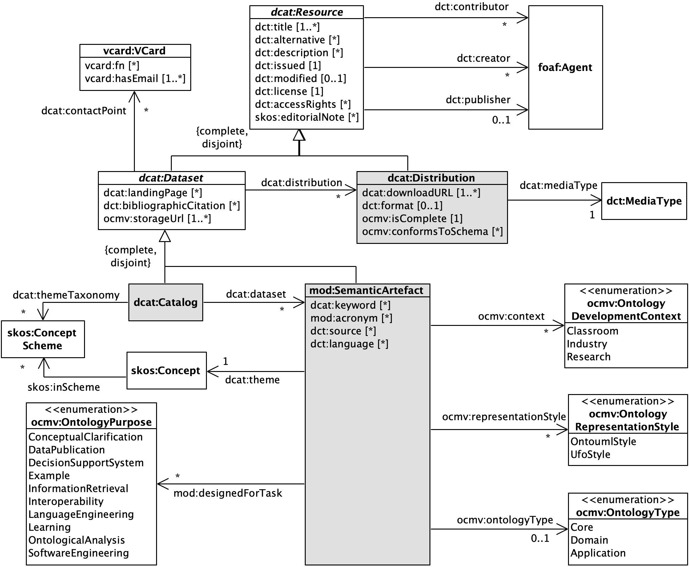

# OntoUML/UFO Catalog

<p align="center">

The FAIR Model Catalog for Ontology-Driven Conceptual Modeling Research, commonly referred to as **OntoUML/UFO Catalog**, is a structured and open-source catalog that contains OntoUML and UFO ontology models. It was conceived to allow collaborative work and to be easily accessible to all its users.

The goal of the OntoUML/UFO Catalog is to support empirical research in OntoUML and UFO, as well as for the general conceptual modeling area, by providing high-quality curated, structured, and machine-processable data on *why*, *where*, and *how* different modeling approaches are used.

The catalog offers a diverse collection of models, created by modelers with varying modeling skills, for a range of domains and different purposes. The models are available in machine-readable formats (JSON and Turtle) and are accessible via permanent identifiers.

The catalog has two data services through which we store and publish its content: this Git repository for data storage, and a FAIR Data Point (FDP) for data discovery. While we outline the FDP in this document, the focus of this documentation is on the catalog’s repository. 

## Table of Contents

- [OntoUML/UFO Catalog](#ontoumlufo-catalog)
  - [Table of Contents](#table-of-contents)
  - [Catalog’s Content](#catalogs-content)
    - [Data Organization](#data-organization)
    - [Catalog Releases](#catalog-releases)
    - [Data Schemas](#data-schemas)
      - [OntoUML Metamodel](#ontouml-metamodel)
      - [OntoUML Schema](#ontouml-schema)
      - [Models in Linked Data](#models-in-linked-data)
    - [Metadata](#metadata)
    - [FAIR Data Point: The Data Discovery Service](#fair-data-point-the-data-discovery-service)
  - [Catalog's Persistent URLs](#catalogs-persistent-urls)
  - [How to Contribute](#how-to-contribute)
    - [Contribute by Submitting an Ontology](#contribute-by-submitting-an-ontology)
    - [Other Ways to Contribute](#other-ways-to-contribute)
  - [Relevant Associated Works](#relevant-associated-works)
  - [Catalog administration](#catalog-administration)
  - [How to Cite this Catalog](#how-to-cite-this-catalog)
  - [Acknowledgements](#acknowledgements)
  - [License disclaimer](#license-disclaimer)

## Catalog’s Content

### Data Organization

This repository contains OntoUML and UFO models and all their distributions, serving as our *de facto* data storage service. We describe below the catalog's repository structure and the files it contains:

```txt
/ontouml-models
|--- catalog.ttl
+--- /models
|     +--- /"model-directory-1"
|          |--- ontology.vpp
|          |--- ontology.json
|          |--- ontology.ttl
|          +--- /original-diagrams
|          |    |--- "diagram-1".png
|          +--- /new diagrams
|          |    |--- "diagram-1".png
|          |--- metadata.ttl
|          |--- metadata-vpp.ttl
|          |--- metadata-json.ttl
|          |--- metadata-turtle.ttl
|          |--- metadata-png-o-"diagram-1".ttl
|          |--- metadata-png-n-"diagram-1".ttl
+--- /shapes
     |--- Resource-shape.ttl
     |--- Dataset-shape.ttl
     |--- Catalog-shape.ttl
     |--- SemanticArtefact-shape.ttl
     |--- Distribution-shape.ttl
```

- `catalog.ttl`: the Turtle file that contains all metadata about the catalog in linked data format.

- `/models`: the directory containing all cataloged models.

- `/"model-directory-1"`: a directory containing a single model and distributions that materialize it. Most model directories' names are composed of information about the model itself, such as the name of the first author, the year of publication, or the name of the model.

- `ontology.*`: the file generated by the modeling tool used to create or reproduce the model. The modeling tool in question must be able to serialize the model in JSON format in conformance with the [Ontouml Schema](https://w3id.org/ontouml/schema) (e.g., the [Visual Paradigm UML CASE](https://www.visual-paradigm.com/download/community.jsp), `.vpp` extension, with the [OntoUML Plugin for Visual Paradigm](https://purl.org/ontouml-vp)).

- `ontology.json`: the JSON serialization of the model in conformance with the [Ontouml Schema](https://w3id.org/ontouml/schema).

- `ontology.ttl`: the Turtle serialization of the model in linked data format described with the [OntoUML Vocabulary](https://w3id.org/ontouml/vocabulary). This file is automatically generated after the JSON serialization.

- `/original-diagrams`: the directory containing all diagrams of the model in PNG format. These diagrams are either (i) created from the original file generated by the modeling used, or (ii) extracted from the source where the model was published (e.g., screenshots from the original publication).

- `/new-diagrams`: the directory containing all diagrams of the model in PNG format.

- `metadata.ttl`: the Turtle file that contains all metadata about the model in linked data format.

- `metadata-vpp.ttl`: the Turtle file that contains all metadata about the model file, the `ontology.vpp` distribution, in linked data format. This file is automatically generated.

- `metadata-json.ttl`: the Turtle file that contains all metadata about the model's JSON serialization file, the `ontology.json` distribution, in linked data format. This file is automatically generated.

- `metadata-turtle.ttl`: the Turtle file that contains all metadata about the model's Turtle serialization file, the `ontology.ttl` distribution, in linked data format. This file is automatically generated.

- `metadata-png-o-"diagram-1".ttl`: a Turtle file that contains all metadata about one of the model's original diagrams, a `/original-diagrams/"diagram-1".png` distribution, in linked data format. A file is automatically generated for each original diagram.

- `metadata-png-n-"diagram-1".ttl`: a Turtle file that contains all metadata about one of the model's new diagrams, a `/new-diagrams/"diagram-1".png` distribution, in linked data format. A file is automatically generated for each new diagram.

- `/shapes`: the directory containing the SHACL shapes used in the validation of metadata schemas.

- `Resource-shape.ttl`: the Turtle file that contains the SHACL shape used to validate metadata about resources of type `dcat:Resource`.

- `Dataset-shape.ttl`: the Turtle file that contains the SHACL shape used to validate metadata about resources of type `dcat:Dataset`.

- `Catalog-shape.ttl`: the Turtle file that contains the SHACL shape used to validate metadata about resources of type `dcat:Catalog`.

- `SemanticArtefact-shape.ttl`: the Turtle file that contains the SHACL shape used to validate metadata about resources of type `mod:SemanticArtefact`.

- `Distribution-shape.ttl`: the Turtle file that contains the SHACL shape used to validate metadata about resources of type `dcat:Distribution`.

### Catalog Releases

The catalog also offers releases comprising all its data and metadata compiled into a single Turtle file. Releases are tagged after the following nomenclature `<YYYY><MM><DD>` and can be accessed via the permanent identifier https://w3id.org/ontouml-models/release/_<release_tag>_.

### Data Schemas

The cataloged OntoUML and UFO models are documented in two different formats, referred to as data schemas: the [OntoUML Schema](https://w3id.org/ontouml/schema) and the [OntoUML Vocabulary](https://w3id.org/ontouml/vocabulary). Both formats are build upon an implementation-independent metamodel, the [OntoUML Metamodel](https://w3id.org/ontouml/metamodel), and are equivalent in terms of the content being represented and are automatically generated by software, but tailored for their individual use cases.

#### OntoUML Metamodel

The [OntoUML Metamodel](https://w3id.org/ontouml/metamodel) allows its specialization on implementation-specific metamodels to be used as manipulation and exchange of OntoUML models by software agents focused on the UML features relevant to OntoUML. It covers several features of the UML metamodel related to its class diagram language, however, simplified to meet the needs of OntoUML.

#### OntoUML Schema

Designed to support the development of model intelligence services in OntoUML, the [Ontouml Schema](https://w3id.org/ontouml/schema) specializes the [OntoUML Metamodel](https://w3id.org/ontouml/metamodel) to specify how to serialize OntoUML models in JSON. In this format, OntoUML can be easily exchanged between clients and servers communicating over HTTP, with extensive support from all major tech stacks, including easy processing within browser applications.

The JSON is a format better suited for manipulation within software code than linked data formats. It supports the exchange of models between modeling tools and the OntoUML server, providing model intelligent services (e.g., model verification and transformation).

#### Models in Linked Data

While JSON offers a suitable solution for exchanging and manipulating models with software, the ability to query models is extremely useful for analyzing them. This is even more pronounced in the context of a catalog of models, where the significant size of the catalog enables, for example, the generation of statistical reports and the detection of recurrent patterns. The serialization of OntoUML models in a linked data format allows us to feed them to a knowledge graph and perform complex analysis using the SPARQL querying language, all with no need for additional software.

### Metadata



The catalog’s schema, depicted in the image above, reuses classes and properties from the following RDF/OWL vocabularies:

- [Data Catalog Vocabulary (DCAT)](http://www.w3.org/ns/dcat): The central vocabulary in our metadata schema, DCAT was “*designed to facilitate interoperability between data catalogs published on the Web*”.

- [Dublin Core Terms (DCT)](http://purl.org/dc/terms/): A vocabulary that defines properties to describe basic metadata of resources on the web.

- [Friend of a Friend (FOAF)](http://xmlns.com/foaf/0.1): A vocabulary that offers terms to describe people, groups, companies, and other types of agents.

- [Metadata for Ontology Description and Publication (MOD)](https://w3id.org/mod/2.0): A vocabulary that defines properties to describe the metadata of ontologies and other semantic artefacts.

- [Simple Knowledge Organization System (SKOS)](http://www.w3.org/2004/02/skos/core): A vocabulary for representing and linking knowledge organization systems.

- [vCard](http://www.w3.org/2006/vcard/ns): A vocabulary to describe contact information (e.g., email, phone number).

As we could not satisfy the metadata needs of our stakeholders using the existing vocabularies alone, we complemented them with one of our own authorship, the [OntoUML/UFO Catalog Metadata Vocabulary](https://w3id.org/ontouml-models/vocabulary). 

The OntoUML/UFO Catalog Metadata Vocabulary was created to satisfy the metadata needs of the [OntoUML/UFO Catalog](https://w3id.org/ontouml-models/git), complementing the catalog's schema with properties to improve the findability and reusability of the catalog and its models. The vocabulary's content can be accessed thgrough the following links:

- [Vocabulary's complete textual specification](https://w3id.org/ontouml-models/vocabulary/docs)
- [Vocabulary's GitHub repository](https://w3id.org/ontouml-models/vocabulary/git)
- [Vocabulary's formal specification in Turtle syntax](https://w3id.org/ontouml-models/vocabulary)

The OntoUML/UFO Catalog Metamodel Vocabulary's elements are identified below by the prefix **ocmv**.

### FAIR Data Point: The Data Discovery Service

The [OntoUML FAIR Data Point](https://w3id.org/ontouml-models) is a deployment of [the FAIR Data Point (FDP) reference implementation](https://doi.org/10.1162/dint_a_00160), which is a FAIR-compliant platform designed to expose semantically rich metadata of FAIR digital objects. Deployed as a web server, the FDP provides important features to the catalog, including the generation of global unique IDs, the generation of webpages for each resource in the catalog based on their semantic annotations, and the search of resources based on textual information or user-defined SPARQL queries. The FDP is automatically synchronized with the data storage, service serving as the *data discovery service* for the catalog.

## Catalog's Persistent URLs

We created persistent URLs for the following resources:

- FDP Catalog page: https://w3id.org/ontouml-models
- GitHub repository: https://w3id.org/ontouml-models/git
- OntoUML vocabulary: https://w3id.org/ontouml
- Catalog's releases:
  - Latest release: https://w3id.org/ontouml-models/release
  - Specific release: https://w3id.org/ontouml-models/release/_<release_tag>_
    - *\<release_tag\>* must be substituted by a release tag string (e.g., '20230602')
- Catalog Vocabulary TTL file: https://w3id.org/ontouml-models/vocabulary
- Shape TTL files:
  - https://w3id.org/ontouml-models/shape/Catalog
  - https://w3id.org/ontouml-models/shape/Dataset
  - https://w3id.org/ontouml-models/shape/Distribution
  - https://w3id.org/ontouml-models/shape/Resource
  - https://w3id.org/ontouml-models/shape/SemanticArtefact

## How to Contribute

Your contribution is fundamental to the catalog's success. We highly encourage authors to submit their models and tools to this catalog. With that, you will be supporting research in (ontology-driven) conceptual modeling, ontology engineering, software design, and several others.

***We greatly appreciate your contribution to this project!***

### Contribute by Submitting an Ontology

The easiest way to contribute to this catalog is to simply send us the following:

1.  your ontology model project;
2.  the model's metadata information; and
3.  the model's associated bibliography (when available).

If you wish to contribute to this initiative by submitting your ontology, use the [catalog's contribution form](https://forms.gle/wNSMfaJfkS3hi69o7).

Note that **anonymous ontologies are allowed in the catalog**. So, if you do not want your name to be displayed in your ontology’s metadata, you just have to inform us and we will keep the model’s authorship anonymous. It is important that, in such case, you must be the owner of the ontology’s legal rights.

If you wish to contribute by submitting someone else's ontology, please chose one entry from the "*Not Started*" or "*Started*" sheets from the [List of UFO and OntoUML Ontology Models](https://docs.google.com/spreadsheets/d/1JXEA3k58yAkV_jbmEc7HP9QK7RgZC5Jk1y8MR7ylFyQ/edit?usp=sharinghttps://docs.google.com/spreadsheets/d/1JXEA3k58yAkV_jbmEc7HP9QK7RgZC5Jk1y8MR7ylFyQ/edit?usp=sharing). Ontologies in the *Started* sheet already have files available in a branch (informed in the spreadsheet), simplifying the collaboration process.

For providing high-quality data, submissions are required to comply with the defined rules to be accepted as part of the catalog. If you have any questions about submitting new models or reusing those available in this catalog, please [create an issue](https://github.com/OntoUML/ontouml-models/issues).

### Other Ways to Contribute

If you wish to contribute to this initiative by **creating and reporting an application** for the catalog, please inform us through the [catalog's contribution form](https://forms.gle/wNSMfaJfkS3hi69o7) or [create an issue](https://github.com/OntoUML/ontouml-models/issues).

If you find any problems in the repository or have ideas for its improvement, please let us know through the [catalog's contribution form](https://forms.gle/wNSMfaJfkS3hi69o7) or by [creating an issue](https://github.com/OntoUML/ontouml-models/issues).

## Relevant Associated Works

The list of works that use the data provided by the OntoUML/UFO Catalog to test algorithms and perform other tasks grows over time. Instead of keeping a manual list in this document, we recommend you access its [Google Scholar](https://scholar.google.com/scholar?cites=3857815022699931555&as_sdt=2005&sciodt=0,5&hl=en) and [ResearchGate](https://www.researchgate.net/publication/364289037_A_FAIR_Model_Catalog_for_Ontology-Driven_Conceptual_Modeling_Research/citations) citation lists to access an updated information.

## Catalog administration

The OntoUML/UFO Catalog is maintained by the [Semantics, Cybersecurity & Services (SCS) Group](https://www.utwente.nl/en/eemcs/scs/) of the [University of Twente](https://www.utwente.nl/), in The Netherlands. Its principal administrators are:

- [Pedro Paulo F. Barcelos](https://orcid.org/0000-0003-2736-7817) [\[GitHub\]](https://github.com/pedropaulofb) [\[LinkedIn\]](https://www.linkedin.com/in/pedro-paulo-favato-barcelos/)
- [Tiago Prince Sales](https://orcid.org/0000-0002-5385-5761) [\[GitHub\]](https://github.com/tgoprince) [\[LinkedIn\]](https://www.linkedin.com/in/tiago-sales/)
- [Mattia Fummagali](https://orcid.org/0000-0003-3385-4769) [\[GitHub\]](https://github.com/Matt-81) [\[LinkedIn\]](https://www.linkedin.com/in/mattiafumagalli/)
- [Claudenir M. Fonseca](https://orcid.org/0000-0003-2528-3118) [\[GitHub\]](https://github.com/claudenirmf) [\[LinkedIn\]](https://www.linkedin.com/in/claudenir-fonseca-52b251216/)

Feel free to get in contact with the administrators using the links provided. For questions, contributions, or to report any problem, you can [open an issue](https://github.com/OntoUML/ontouml-models/issues) at this repository.

## How to Cite this Catalog

Please cite the OntoUML/UFO Catalog as:

* Prince Sales, T., Barcelos, P. P. F., Fonseca, C. M., Souza, I. V., Romanenko, E., Bernabé, C. H., Bonino da Silva Santos, L. O., Fumagalli, M., Kritz, J., Almeida, J. P. A., & Guizzardi, G. (2023). A FAIR catalog of ontology-driven conceptual models. Data & Knowledge Engineering, 147, 102210. https://doi.org/10.1016/j.datak.2023.102210. Permanent URL: <https://w3id.org/ontouml-models/>.

For creating citations using different formats, refer to the [webpage of the paper's publisher](https://link.springer.com/chapter/10.1007/978-3-031-17995-2_1#citeas) for getting the paper's complete information.

For obtaining the paper's complete BibTeX record, we recommend downloading this information on [the same webpage](https://citation-needed.springer.com/v2/references/10.1007/978-3-031-17995-2_1?format=bibtex&flavour=citation) or accessing it on the [DBLP BibTeX record](https://dblp.org/rec/conf/er/BarcelosSFFSRKG22.html?view=bibtex).

This paper reflects the state of the catalog as of June 2022.

## Acknowledgements

We would like to thank all the [contributors](https://github.com/OntoUML/ontouml-models/graphs/contributors) to the OntoUML/UFO Catalog, as well as all the modelers who shared their work and allowed us to include it here.

## License disclaimer

The OntoUML/UFO Catalog is licensed under the [Creative Commons Attribution-ShareAlike 4.0 International Public License.](https://creativecommons.org/licenses/by-sa/4.0/)

Although the OntoUML/UFO Catalog is an open project with a permissive license, special attention must be given to the following licensing clauses:

- The OntoUML/UFO Catalog is a noncommercial work created strictly for academic research purposes.
- This license only applies to the catalog structure itself, not to the models included in the repository.
- Information about licensing of individual ontologies included in the catalog can be found on their related metadata.yaml file.
- The models included in the repository were obtained directly from the authors or academic sources using open or valid licensed access.
- This license by no means overwrites the license of the models included in the repository, which maintain their original license.
- All catalog ontologies that are without explicit licensing information on their associated metadata.yaml file must be interpreted as being private and having a restrictive license.
- License holders sending their models to the OntoUML/UFO Catalog expressly agree that the sent content is going to be hosted and made available for other users in the terms of this license.
- Whoever uses the OntoUML/UFO Catalog expressly understands and agrees with its licensing information.

Ontologies are going to be immediately removed from the catalog in case of a request by the original license holders. For content removal, please [create an issue](https://github.com/OntoUML/ontouml-models/issues) or report it through the [catalog's contribution form](https://forms.gle/wNSMfaJfkS3hi69o7).
